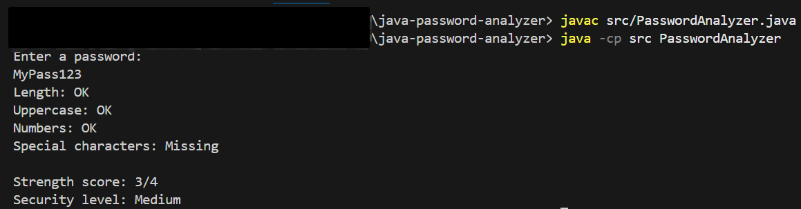

# Password Strength Analyzer (Java)

Simple security tool written in **Java** that analyzes password strength based on common security criteria.

The program evaluates a password using:

- Length
- Uppercase letters
- Numbers
- Special characters

It then calculates a **security score** and classifies the password as weak, medium, or strong.

---

## Demo

## Example

Enter a password: MyPass123

Password analysis

Length: OK
Uppercase: OK
Numbers: OK
Special characters: Missing

Strength score: 3/4
Security level: Medium

---

## Technologies

- Java
- Regular Expressions (Regex)
- Command Line Interface (CLI)

---

## Project Structure

java-password-analyzer
│
├── src
│ └── PasswordAnalyzer.java
│
└── README.md

---

## How to Run

Compile the program:

javac src/PasswordAnalyzer.java

Run the program:

java -cp src PasswordAnalyzer

---

## Why this project?

This project demonstrates:

- Java fundamentals
- Regex pattern matching
- Conditional logic
- Basic cybersecurity awareness

---

## Author

Johannes Guzmán G.